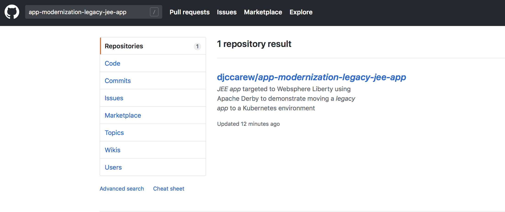

# IBM Client Developer Advocacy App Modernization Series

## Lab - Creating your own Helm repositories and deploying to IBM Cloud Private 

## Overview 

Helm is a package manager for Kubernetes. Package managers automate the process of installing, configuring, upgrading, and removing computer programs. Examples include the Red Hat Package Manager (RPM), Homebrew, and Windows® PackageManagement.

An application in Kubernetes typically consists of at least two resource types: a deployment resource, which describes a set of pods to be deployed together, and a services resource, which defines endpoints for accessing the APIs in those pods. The application can also include ConfigMaps, Secrets, and Ingress.

For any deployment, you need several Kubernetes commands (kubectl) to create and configure resources. Instead of manually creating each resource separately, you can create many resources with one command grealtly simplifying the process and allowing you to manage the releted resources as a single unit called a chart. 

A Helm chart repository is an HTTP server that houses packaged charts and an index.yaml file. That file has an index of all the charts in the repository. A chart repository can be any HTTP server that can serve YAML and .tar files and can answer GET requests. Therefore, you have many options for hosting your chart repository. You can use a Google Cloud Storage bucket, an Amazon S3 bucket, GitHub pages, or you can create a web server.

In this lab you'll create a Helm chart repository and use it to deploy a simple JEE app to IBM Cloud Private using the Helm CLI

### Step 1: Clone the Github repo that contains the code and templates  used to create the Helm repository 

1. Login in [your Github account](https://github.com)

2. In the search bar at the top left type in `app-modernization-legacy-jee-app` 



3. Select the repository `djccarew/app-modernization-legacy-jee-app` and then click on the **Fork** icon

4. Click the **Clone or download** button and copy the HTTPS URL to your clipboard


5. In a terminal window with the git client type in the following commands  appending the HTTS URL from your clipboard

```
     git clone [HTTPS URL for NEW REPO]
     cd app-modernization-helm-lab
     
```
6. Using the Github's UI  file browser to  take a look at the files in the **chart** folder. This is a Helm chart with child charts for the web app and Apache Derby(database)  portions of the app.

### Step 2: Create the artifacts for the Helm repository 

1. From the command line type in (or copy and paste in) the following (uncommented) commands 
```
   # Create  a folder for the Helm repository 
   mkdir -p docs/charts
   
   # Helm charts get their names from the  folder they reside in.
   # Rename the folder to something unique  when using a shared ICP Cluster for this lab
   # Substitute your username (eg user04) for [uname]
   mv chart/liberty-starter chart/liberty-starter-[uname]
   
   # Generate the chart archive. Substitute your username (eg user04) for [uname]
   helm package chart/liberty-starter-[uname]
   
   # Move generated tar.gz file to directory created for repo 
   # Substitute your username (eg user04) for [uname]
   mv liberty-starter-[uname]-1.0.0.tgz docs/charts
   
   # Generate index for repository
   # substitute your github username for [ghuname]
   helm repo index docs/charts --url https://[ghuname].github.io/app-modernization-legacy-jee-app/charts
   
```

2. From the command line type in (or copy and paste in) the following (uncommented) commands to push your changes to Github
```
   # Flag changes to be pushed
   git add .
   
   # Commit changes
   git commit -m 'Generated Helm repo for sample app'
   
   # Push to remote Github repo (you may be prompted for your Github credentials
   git push -u origin master
```

### Step 3: Configure Github to serve up the repo via HTTP/HTTPS

1. In the Settings for your repo in the *GitHub Pages* section select the *master branch /docs folder* for GitHub Pages.


2. In your terminal window type the following command, substituting your github username for *[ghuname]*. Verify that the contents of *index.yaml* are returned
```
   curl https://[ghuname].github.io/app-modernization-legacy-jee-app/charts/index.yaml
```

### Step 4: Add your repo to the IBM Cloud Private list of repos

1. In your terminal window type the following command, substituting your logged in  username for [uname] as the repo name  and your github username for [ghuname]  **Note**: Your repo name must be unique accross the IBM Cloud Private  Cluster 
```
   helm repo add [uname] https://[ghuname].github.io/app-modernization-legacy-jee-app/charts --tls
```

### Step 5: Deploy the legacy JEE app from your new Helm repo
   
1. In your terminal window type the following command, substituting your logged in  username for [uname] and your ICP namespace for [yournamespace].  **Note**: Helm charts can be deployed multiple  times but each deployment must have a unique name
```
   # Subsitute your user name for [uname] (eg user04)
   helm install --namespace [yournamespace] --name liberty-starter-[uname] [uname]/liberty-starter-[uname] --tls
```

### Step 6: Launch your deployed app

You can run commands to get the endpoint and port number of your deployed Helm release but it's easier to launch the app from the IBM Cloud Private Web UI.

1. Launch the IBM Cloud Private Web UI using the URL given to you by your instructor and login in.

2. In the Navigation area on the left expand **Workloads** and select **Helm Releases**

3. Look for your Helm Releases in the list and click on the **Launch** link on the right

4. Verify that the app's UI opens in another tab. Enter your name in the textbox  and hit the return key. Verify that your name appears below the textbox as the app stores your name in a  database and then retireves it and displays it in  the UI.
   
## Summary

With even small simple apps requiring   multiple Kubernetes objects,  Helm charts greatly simplify the process of distributing and updating your Kubernetes based apps. Helm repos allow you to distribute your Helm charts via HTTP, further simplifying the process of distributing and deploying your apps.
