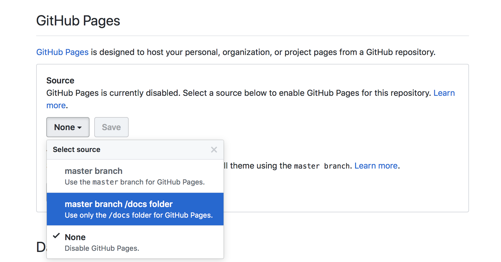
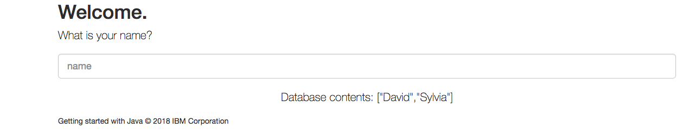

# IBM Client Developer Advocacy App Modernization Series

## Lab - Migrating Legacy JEE apps to IBM Cloud Kubernetes Service

### Part 1 - Working with Helm

## Overview

Helm is a package manager for Kubernetes. Package managers automate the process of installing, configuring, upgrading, and removing computer programs. Examples include the Red Hat Package Manager (RPM), Homebrew, and Windows® PackageManagement.

An application in Kubernetes typically consists of at least two resource types: a deployment resource, which describes a set of pods to be deployed together, and a service resource, which defines endpoints for accessing the APIs in those pods. In additional to a deployment and a service, an application will typically include other Kubernetes resource types such as ConfigMaps, Secrets, and Ingress.

For any application in Kubernetes, you will need to run several Kubernetes commands (`kubectl`) to create and configure resources. With Helm, instead of manually creating each resource separately, you can create many resources with one command (`helm install`). This greatly simplifies the process and allows you to manage the related resources as a single unit called a Helm chart.

Helm charts are stored in a Helm chart repository, which is an HTTP server that houses packaged charts and an `index.yaml` file. The `index.yaml` file has an index of all the charts in the repository. A chart repository can be any HTTP server that can serve YAML and .tar files and can answer GET HTTP requests. Therefore, you have many options for hosting your chart repository such as a Google Cloud Storage bucket, an Amazon S3 bucket or you can create your own web server. For this lab, we will be using GitHub Pages to host our chart repository.

In this lab you'll create a Helm chart repository and use it to deploy a small JEE app to the IBM Cloud Kubernetes Service using the open source Helm CLI.

### Setup

1. If following this lab as part of an IBM instructor led workshop, please follow these instructions to setup your workshop environment: https://gist.github.com/jzaccone/0cdc321e5dc8adb0dca98ca861284c01

2. Initialize Helm client
```
   helm init --client-only
```

### Step 1: Clone the Github repo that contains the code, build an Open Liberty image of the app and then push it to the IBM Cloud Kubernetes container registry

1. Login in [your Github account](https://github.com)

2. In the search bar at the top left type in `app-modernization-plants-by-websphere-jee6`

    

3. Select the repository `djccarew\app-modernization-plants-by-websphere-jee6` and then click on the **Fork** icon

4. Click the **Clone or download** button from your copy of the forked repo and copy the HTTPS URL to your clipboard

    

5. From a client terminal window clone the Git repo  with  the following commands  appending the HTTPS URL from your clipboard

    ```text
    git clone [HTTPS URL for NEW REPO]
    cd app-modernization-plants-by-websphere-jee6
    ```
6. Build the application .ear file using Maven by typing in (or copying and pasting in) the following command

    ```text
    mvn package
    ```

7. Build a docker image  by typing in (or copying and pasting in) the following (uncommented) commands

    ```bash
    # Note substitute your  namespace  for [YOUR_NAMESPACE]
    docker build -t us.icr.io/appmod_ss/[YOUR_USERNAME]/pbw-mariadb-web:1.0.0 .
    ```

8. Log in to the Container registry with the following command:

    ```bash
    ibmcloud  cr login
    ```

9. Push the image to the IBM Container registry by typing in (or copying and pasting in) the following (uncommented) commands

    ```bash
    # Note substitute your username e.g. user05 for  [YOUR_USERNAME]
    docker push us.icr.io/appmod_ss/[YOUR_USERNAME]/pbw-mariadb-web:1.0.0
    ```

### Step 2: Look at the structure of the Helm chart for the Plants By WebSphere app

1. Login in [your Github account](https://github.com)

2. Select your fork  of the repository **app-modernization-plants-by-websphere-jee6** that you forked in the previous lab.

3. Using the Github's UI  file browser to  take a look at the files in the **chart** folder. This is a Helm chart with child charts for the web app and MariaDB  portions of the app. Since there already is a published chart for  MariaDB, it is listed  as a required child chart in the file **requirements.yaml** and you don't have to create a chart for the MariaDB portion of the app.

### Step 3: Create the artifacts for the Helm repository


1. From your client terminal  type in (or copy and paste in) the following (uncommented) commands
```
   # Fetch required MariaDB chart
   helm repo add ibmcom https://raw.githubusercontent.com/IBM/charts/master/repo/stable
   helm dependency update chart/pbw-liberty-mariadb

   # Generate the chart archive.
   helm package chart/pbw-liberty-mariadb -d docs/charts

   # Generate index for repository
   # substitute your github username for [ghuname]
   helm repo index docs/charts --url https://[ghuname].github.io/app-modernization-plants-by-websphere-jee6/charts

```

2. From the command line type in (or copy and paste in) the following (uncommented) commands to push your changes to Github
```
   # Configure your git profile on the system
   git config --global user.email "[your-github-account-email]"
   git config --global user.name "[your github username]"

   # Flag changes to be pushed
   git add .

   # Commit changes
   git commit -m 'Generated Helm repo for sample app'

   # Push to remote Github repo (you may be prompted for your Github credentials)
   git push -u origin master
```

### Step 4: Configure Github to serve up the repo via HTTP/HTTPS

1. In the Settings for your repo in the *GitHub Pages* section select the *master branch /docs folder* for GitHub Pages and click **Save**.



2. In your terminal window type the following command, substituting your github username for *[ghuname]*. Verify that the contents of *index.yaml* are returned
```
   curl https://[ghuname].github.io/app-modernization-plants-by-websphere-jee6/charts/index.yaml
```

### Step 5: Add your repo to you list of Helm repos

1. In your terminal window type the following command, substituting your  github username for [ghuname]  
```
   # Substitute your github username for [ghuname]
   helm repo add my-repo https://[ghuname].github.io/app-modernization-plants-by-websphere-jee6/charts
```

### Step 6: Deploy the legacy JEE app from your new Helm repo

1. In your terminal window type the following command, substituting your namespace for [yournamespace].  **Note**: Helm charts can be deployed multiple  times but each deployment must have a unique name
```
   helm install --name pbw-liberty-mariadb --set liberty.image.registry=us.icr.io --set liberty.image.namespace=[yournamespace] my-repo/pbw-liberty-mariadb
```

### Step 7: Launch your deployed app

You'll commands to get the endpoint and port number of your deployed Helm release.

1. Run the following command to get the port number of your deployed app
```
   kubectl --namespace default get service pbw-liberty-mariadb-liberty -o jsonpath='{.spec.ports[0].nodePort}'
```

2. Run the following command to get the external IP address  of the first worker node in your cluster
```bash
   # Substitute your cluster name e.g. user05-cluster for [YOUR_CLUSTER_NAME]
   ibmcloud cs workers [YOUR_CLUSTER_NAME] | grep -v '^*' | egrep -v "(ID|OK)" | awk '{print $2;}' | head -n1
```
3. In your browser's address bar enter the URL of your deployed app. The URL will be the external IP address of the first worker in your cluster followed by a colon and then followed by the port number of your deployed app. For example if your external IP is 169.61.73.182 and the port is 30961 the URL will be ```http://169.61.73.182:30961```

4. Verify that the app's UI opens in another tab. Click on the **HELP** link.



5. Click on **Reset database** to populate the MariaDB database with data

6. Verify that browsing different sections of the online catalog shows product descriptions and images.


## Summary

With even small simple apps requiring multiple Kubernetes objects,  Helm charts greatly simplify the process of distributing and updating your Kubernetes based apps. Helm repos allow you to distribute your Helm charts via HTTP, further simplifying the process of distributing and deploying your apps.
